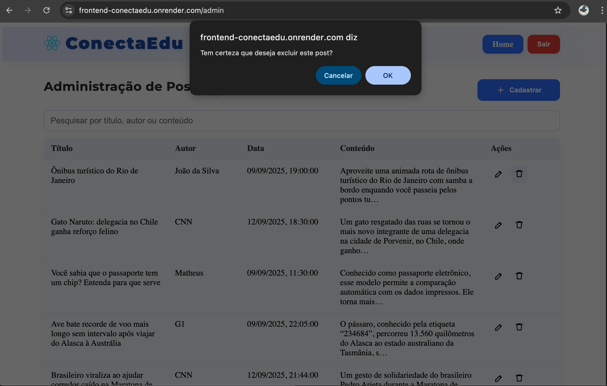
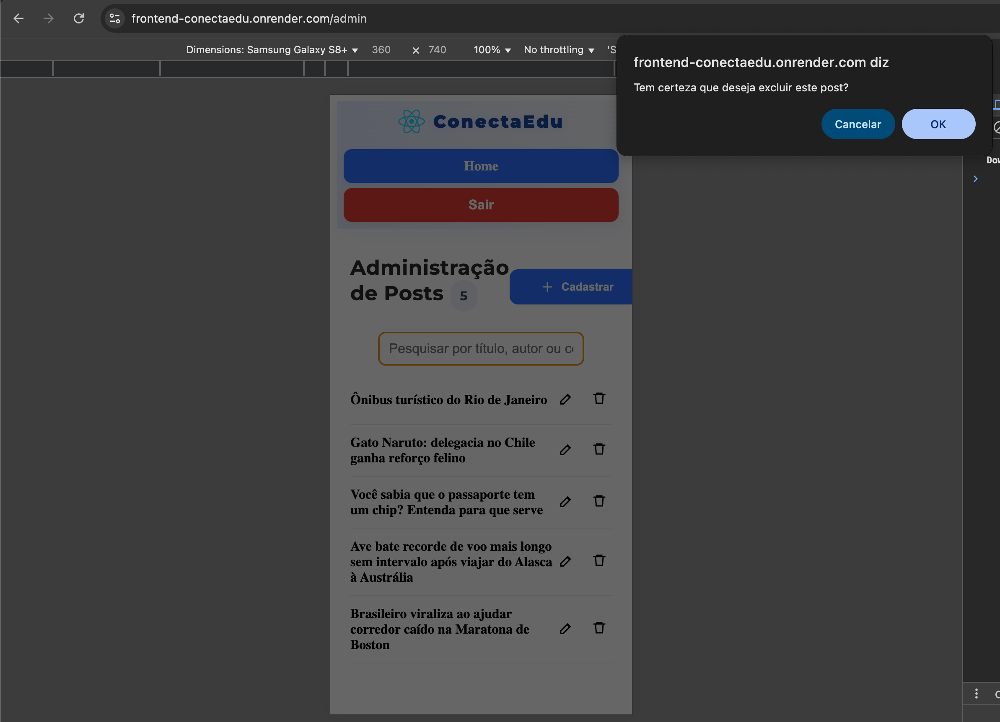

<div align="center">
	
	
	
	
</div>

# 🚀 FrontEnd ConectaEdu


Bem-vindo ao projeto **FrontEnd ConectaEdu**! Este é o frontend de uma plataforma educacional moderna, desenvolvida com React, TypeScript e Vite.

---


## 📑 Índice


- [🛠️ Tecnologias Utilizadas](#-tecnologias-utilizadas)
- [🌐 Aplicação Online](#-aplicação-online)
- [🐳 Como executar via Docker](#-como-executar-via-docker)
- [🚩 Como rodar o projeto localmente](#-como-rodar-o-projeto-localmente)
- [📝 Funcionalidades](#-funcionalidades)
- [📦 Estrutura do Projeto](#-estrutura-do-projeto)

---

---


## 🛠️ Tecnologias Utilizadas
-  [React](https://react.dev/)
-  [TypeScript](https://www.typescriptlang.org/)
-  [Vite](https://vitejs.dev/)
-  [ESLint](https://eslint.org/)
-  [Docker](https://www.docker.com/)

---


## 🌠Aplicação Online 

Acesse a aplicação está disponível em:

[https://frontend-conectaedu.onrender.com/](https://frontend-conectaedu.onrender.com/)

**Obs.: O primeiro acesso pode apresentar erros, pois Render apresenta um delay para ativar o backend. Para agilizar o carregamento é recomendado acessar o [backend](https://conectaedu.onrender.com), aguardar alguns instantes e recarregar a página**

---


## 🳠Como executar via Docker 

Você pode rodar o projeto diretamente usando a imagem disponível no Docker Hub:

1. **Baixe a imagem:**
	```bash
	docker pull cascaessama/frontend-conectaedu
	```
2. **Execute o container:**
	```bash
	docker run -d -p 5173:80 cascaessama/frontend-conectaedu
	```
3. **Acesse no navegador:**
	[http://localhost:5173](http://localhost:5173)

Pronto! O frontend estará disponível localmente usando Docker.

---


## 🚩 Como rodar o projeto localmente 

1. **Clone o repositório:**
	```bash
	git clone https://github.com/cascaessama/FrontEndConectaEdu.git
	cd FrontEndConectaEdu
	```
2. **Instale as dependências:**
	```bash
	npm install
	```
3. **Inicie o servidor de desenvolvimento:**
	```bash
	npm run dev
	```
4. **Acesse no navegador:**
	[http://localhost:5173](http://localhost:5173)

---

---

## 📝 Funcionalidades
---

###  Acesso alunos
####  Homepage
Página inicial amigável e intuitiva, onde os alunos podem visualizar novidades e informações importantes da plataforma.

<div align="center" style="display: flex; gap: 20px; justify-content: center;">
	
	
</div>

####  Pesquisa
Permite aos alunos buscar rapidamente por posts, conteúdos e informações relevantes dentro da plataforma, facilitando o acesso ao que desejam encontrar.

<div align="center" style="display: flex; gap: 20px; justify-content: center;">
	
	
</div>

####  Exibição de posts
Os alunos têm acesso a uma lista de posts publicados, podendo visualizar detalhes e interagir com o conteúdo disponibilizado pelos professores.

<div align="center" style="display: flex; gap: 20px; justify-content: center;">
	
	
</div>

---

###  Acesso professor
####  Login
Área para autenticação dos professores, garantindo acesso seguro às funcionalidades administrativas da plataforma (Usuário/Senha: professor1/fiap25).

<div align="center" style="display: flex; gap: 20px; justify-content: center;">
	
	
</div>

####  Admin
Painel administrativo onde o professor pode gerenciar posts e visualizar publicado.

<div align="center" style="display: flex; gap: 20px; justify-content: center;">
	
	
</div>

####  Pesquisa de post
Ferramenta que permite ao professor localizar rapidamente posts já cadastrados, facilitando a gestão e edição dos conteúdos.

<div align="center" style="display: flex; gap: 20px; justify-content: center;">
	
	
</div>

####  Cadastro de post
Funcionalidade para criação de novos posts, permitindo ao professor compartilhar informações, novidades e materiais com os alunos.

<div align="center" style="display: flex; gap: 20px; justify-content: center;">
	
	
</div>

####  Edição de post
Permite ao professor atualizar e modificar posts existentes, mantendo o conteúdo sempre relevante e atualizado.

<div align="center" style="display: flex; gap: 20px; justify-content: center;">
	
	
</div>

####  Remoção de post
Opção para excluir posts que não são mais necessários, garantindo que apenas informações relevantes permaneçam visíveis aos alunos.

<div align="center" style="display: flex; gap: 20px; justify-content: center;">
	
	
</div>

---


---

## 📦 Estrutura do Projeto 

```
├── public/
│   └── vite.svg
├── src/
│   ├── App.tsx
│   ├── main.jsx
│   ├── assets/
│   │   └── react.svg
│   ├── components/
│   │   ├── Header.tsx
│   │   └── LoginForm.tsx
│   ├── declarations.d.ts
│   └── pages/
│       ├── Admin.tsx
│       ├── Cadastrar.tsx
│       ├── Editar.tsx
│       ├── Home.tsx
│       └── LerPost.tsx
├── images/
│   ├── Homepage/
│   │   ├── mobile.png
│   │   └── web.png
│   ├── Exibicao/
│   │   ├── mobile.png
│   │   └── web.png
│   ├── Login/
│   │   ├── mobile.png
│   │   └── web.png
│   ├── admin/
│   │   ├── mobile.png
│   │   └── web.png
│   ├── cadastro/
│   │   ├── mobile.png
│   │   └── web.png
│   ├── editar/
│   │   ├── mobile.png
│   │   └── web.png
│   ├── remover/
│   │   ├── mobile.png
│   │   └── web.png
│   ├── PesquisaAluno/
│   │   ├── mobile.png
│   │   └── web.png
│   ├── PesquisaProfessor/
│   │   ├── mobile.png
│   │   └── web.png
├── Dockerfile
├── eslint.config.js
├── index.html
├── package.json
├── tsconfig.json
├── vite.config.ts
└── README.md
```

---